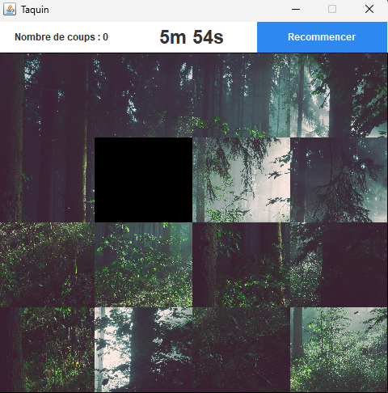

# Jeu du Taquin & Splitter

## Description

Jeu du Taquin implémenté en Java à l'aide de la bibliothèque graphique Swing.

## Règles du jeu

Le taquin est un jeu de puzzle qui se joue sur une grille carrée, en 4x4, où il manque une case. 
Le but du jeu est de réorganiser les tuiles numérotées en les faisant glisser dans l'espace vide, afin de reconstituer une image ou un ordre numérique prédéfini.

## Fonctionnalités principales

+ Reconstituer une image.

+ Reconstituer un ordre numérique.

## Comment lancer le jeu

Les scripts permettant de lancer le jeu sont disponibles dans le dossier `dist`.

+ LINUX : lancer le fichier `./run.sh` pour lancer le jeu.

+ WINDOWS : lancer le fichier `./run.bat` pour lancer le jeu.

## Comment découper une image

J'ai mis à votre disposition un splitter permettant de découper une image en plusieurs morceaux. Il est disponible dans le dossier `dist`.

+ LINUX : lancer le fichier `./splitter.sh <chemin image> <lignes> <colonnes>`.
    + Exemple : `./splitter.sh /home/user/image.jpg 4 4`.
    + Exemple : `./splitter.sh image.jpg 4 4`.
+ WINDOWS : lancer le fichier `./splitter.bat <chemin image> <lignes> <colonnes>`.
    + Exemple : `./splitter.bat C:\Users\user\image.jpg 4 4`.
    + Exemple : `./splitter.bat image.jpg 4 4`.
+ DEFAUT : lancer la commande `java -jar splitter.jar <chemin image> <lignes> <colonnes>`.
    + Exemple : `java -jar splitter.jar /home/user/image.jpg 4 4`.
    + Exemple : `java -jar splitter.jar C:\Users\user\image.jpg 4 4`.

## Comment paramétrer le jeu

+ Pour paramétrer le jeu, il suffit de modifier le fichier `config.properties` se trouvant dans le dossier `dist`.

+ Pour ajouter une nouvelle image vous devrez l'ajouter dans le dossier `src/taquin/resources/cutout_images/votreformat/vosimages`. 
  + Vous devrez ensuite recompiler le projet avec ANT ou manuellement via le terminal.

## Utilisation du fichier ANT

Le fichier `build.xml` se trouve à la racine du projet. Il permet de compiler le projet via ANT.

+ `ant run` pour lancer et recompiler le jeu.

+ `ant dist-taquin` pour recompiler le jeu.

+ `ant dist-splitter` pour recompiler le splitter.

+ Ouvrez le fichier `build.xml` pour plus d'informations.

## Contribuer

+ N'hésitez pas à signaler des bugs.

+ N'hésitez pas à améliorer le code existant.

## Licence

Ce projet est sous licence [MIT].

## Captures d'écran

## Crédits des photos

J'ai utilisé des photos provenant du site [Unsplash](https://unsplash.com/).

+ Photo du [renard brun couché sur le rocher noir](https://unsplash.com/fr/photos/renard-brun-couche-sur-le-rocher-noir-nOsJYzXEG98) par [Dušan veverkolog](https://unsplash.com/fr/@veverkolog).

+ Photo des [arbres sur la foret avec les rayons du soleil](https://unsplash.com/fr/photos/arbres-sur-la-foret-avec-les-rayons-du-soleil-sp-p7uuT0tw) par [Sebastian Unrau](https://unsplash.com/fr/@sebastian_unrau).

+ Photo [a plat de feuilles violettes et rouges](https://unsplash.com/fr/photos/photographie-a-plat-de-feuilles-violettes-et-rouges-O6N9RV2rzX8) par [Jeremy Thomas](https://unsplash.com/fr/@jeremythomasphoto).
